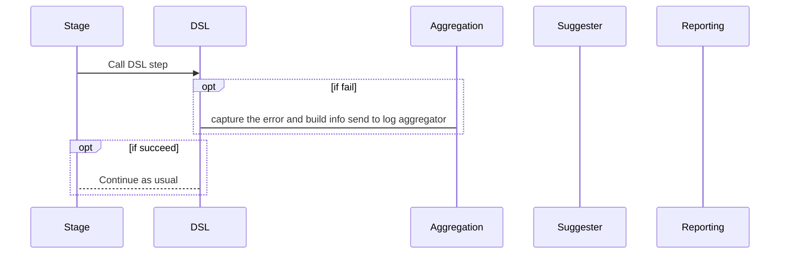

# jenkins-failure-suggestion

Get the log of the error, then suggest solution to user.
## Motivation
In normal businesses, identity management and access management are not important, so Jenkins is only used for building/deploying. In financial sector, IAM has to conform to audit standard. This leads to the fragmentation of three areas:
- Identity
- Authentication
- Authorization
This makes it hard to onboard application teams to Jenkins. Besides, engineers rarely touch DevOps tools. Quite a few principals do not know how to debug. This system aims to fix this.
### The gist
- Put a try-catch around the DSL. This will capture the log and send it to the reporting site.
- A pattern matcher on the reporting site will do a regex match and suggest solutions. This can be replaced by an AI/learning algorithm as needed.

## Design

